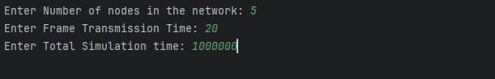
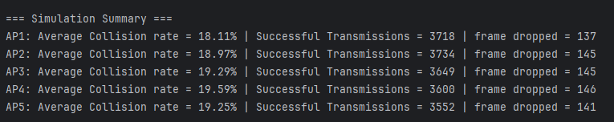

# A Python code to study the impact of density of network density on node's FER. 

# Introduction
This project analyzes how node density impacts collision and frame error rate (FER) in CSMA/CA networks.

# Usage
Simply run the Node_Density_VS_FER_CSMA_CA.py file.
The program will prompt you to enter the following inputs:

Number of nodes in the network

Frame transmission time (in time slots)

Simulation time (in time slots)

Note: The duration of one time slot is 10 µs.

Example:

At the end of the simulation, the terminal displays the error rate of each node.

